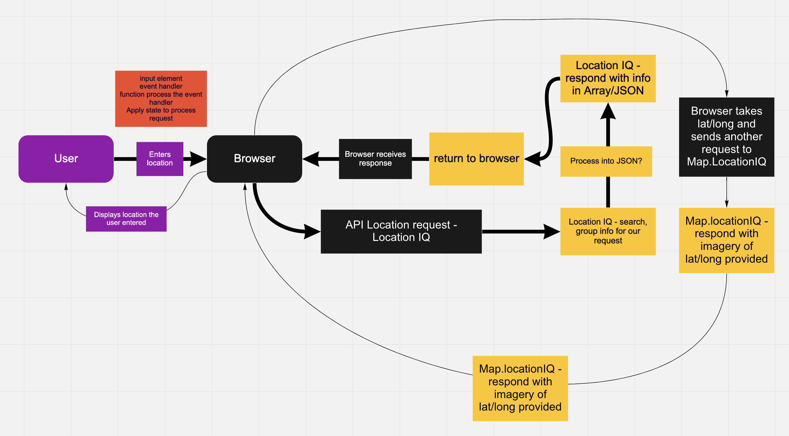
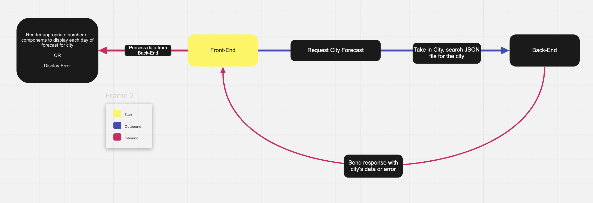
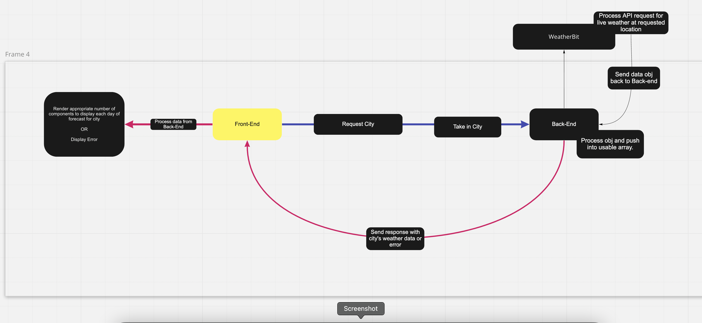

# City Explorer API

**Author**: Haustin Kimbrough
**Version**: 1.0.0 (increment the patch/fix version number if you make more commits past your first submission)

## Overview
City Explorer is a React application that queries the user(s) for a location (city), request an API from [LocationIQ](https://locationiq.com/), and then display that location through imagery/mapping. City Explorer also informs users of request errors. City Explorer API allows users to query three different cities, searches a local .JSON file for one of three cities and renders a weather forecast for them or an error if none of those cities were selected.

### Day 1 WRRC

### Day 2 WRRC

### Day 3 WRRC

## Getting Started
<!-- What are the steps that a user must take in order to build this app on their own machine and get it running? -->
In order to build City Explorer API, you need to create a GitHub repository, clone it down to your local machine, run npm init in your terminal and npm install express, dotenv, and cors. This will set up the machine appropriately.

Create and import the data.json file in here to have something to render for users.

You will need to setup a way to communicate with the front-end.

## Architecture
<!-- Provide a detailed description of the application design. What technologies (languages, libraries, etc) you're using, and any other relevant design information. -->
Back-end is ran through Node.js with JS, front-end is using React with JS, styling is using React-bootstrap and CSS3. Front-end calls for APIs from LocationIQ.

## Change Log

<!-- Use this area to document the iterative changes made to your application as each feature is successfully implemented. Use time stamps. Here's an example:

01-01-2001 4:59pm - Application now has a fully-functional express server, with a GET route for the location resource. -->

### Lab07 - Feature 1

Name of feature: Weather

Estimate of time needed to complete: 150 minutes

Start time: 16:22

Finish time: 19:30

Actual time needed to complete: 188 minutes

### Lab07 - Feature 2

Name of feature: Error

Estimate of time needed to complete: 60 minutes

Start time: 22:00

Finish time: 22:56

Actual time needed to complete: 56 minutes

### Lab08 - Feature 1

Name of feature: Weather (live)

Estimate of time needed to complete: 120 minutes

Start time: 14:00

Finish time: 16:26

Actual time needed to complete: 146 minutes

### Lab08 - Feature 2

Name of feature: Movies

Estimate of time needed to complete: 45 minutes

Start time: 17:50

Finish time: 21:29

Actual time needed to complete: about 120 minutes

## Credit and Collaborations
<!-- Give credit (and a link) to other people or resources that helped you build this application. -->
- [Christopher Burk](https://github.com/cburk2019) worked with me to create the WRRC
- [Code Fellows Code 301 Class Repo](https://github.com/codefellows/seattle-code-301d77) for .gitignore.
- TA Hexx King helped a ton with Lab 08 - Feature 1.
